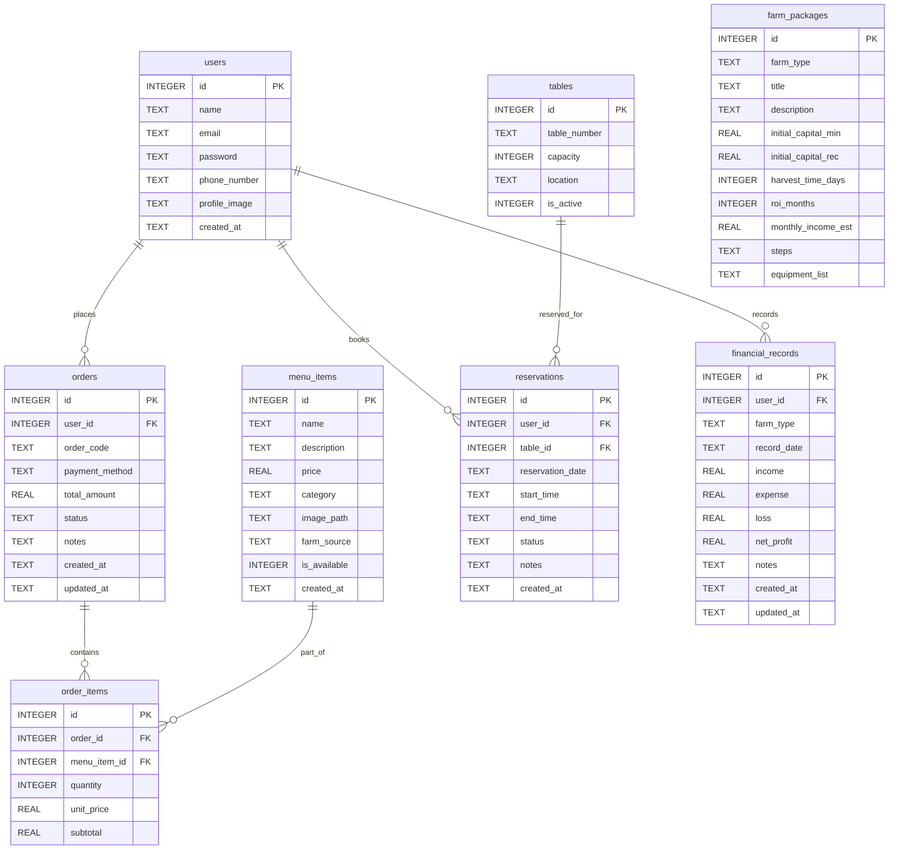

# Product Requirement Document (PRD): Komars App

---

## 1. Document Control & Project Metadata

| Attribute | Details |
| :--- | :--- |
| **Project Name** | Komars App (Ekosistem Agri-Kuliner Farm-to-Table) |
| **Context** | Tugas Besar PPBL | Assessment 2 & 3 |
| **Institution** | Telkom University 2025 |
| **Development Team** | **Salman** (Komars Express - F&B Core)<br>**Ega** (Komars Express - Reservasi & Meja)<br>**Vemas** (Komars Farm - Agribisnis & Keuangan) |
| **Status** | Approved / Baseline |

---

## 2. Product Vision & Value Proposition

**Komars App** is a unified, meaningful mobile application that bridges the gap between sustainable farming (Agribisnis) and high-quality food services (F&B) under a single **Farm-to-Table** ecosystem. 

Unlike standard CRUD applications, Komars App delivers two core pillars:
1. **Komars Express (F&B Core & Dine-in)**: A premium restaurant ordering, custom menu sourcing, table layout management, and booking/reservation system.
2. **Komars Farm (Agribisnis & Partner Ecosystem)**: An agricultural starter kit and financial tracker designed for partner farms supplying fresh ingredients to Komars Express.

---

## 3. Compliance & Assessment Framework

To meet the official requirements for **Assessment 2 & 3**, the application must adhere to the following technical and functional matrices:

### 3.1 Compliance Requirements Matrix
| Criteria | Assessment 2 Requirements | Assessment 3 Requirements (Final) |
| :--- | :--- | :--- |
| **Database** | SQLite required (DatabaseHelper + DAO Pattern) | SQLite continued and expanded |
| **Local Storage** | SharedPreferences required | SharedPreferences continued and expanded |
| **CRUD Features** | 6 operations total (2 per developer) | Fully integrated and functional |
| **SharedPref Keys** | 6 keys minimum (2 per developer) | Restored states & user session configurations |
| **Custom Widgets** | Not required | **Wajib 1 per developer** (Must contain logic/interactivity, not just styling) |
| **Gestures & Animations** | Not required | **Wajib minimal 1 per developer** |
| **External Libraries** | Not required | **Wajib 3-5 libraries** (in addition to `sqflite` and `shared_preferences`) |
| **Meaningful Theme** | Verified | Evaluated strictly (Agri-kuliner Farm-to-Table integration) |
| **App Flow** | End-to-end happy path | Fully functional and cohesive user journey |

---

## 4. System Architecture & Folder Structure

The project implements a **Feature-Based Modular** structure to ensure high cohesion, loose coupling, and clean separation of concerns. Common resources are encapsulated inside `core/`.

```
lib/
├── main.dart
├── app.dart                                    # MaterialApp, routes, ThemeData
├── core/                                       # Shared & stable components
│   ├── database/
│   │   ├── database_helper.dart                # SQLite init, schema creation
│   │   └── seed_data.dart                      # Seeding initial menus, tables, and farm packages
│   ├── constants/
│   │   ├── pref_keys.dart                      # SharedPreferences keys
│   │   ├── app_colors.dart                     # Harmonious HSL brand colors
│   │   └── app_strings.dart                    # Reusable localized/static UI labels
│   ├── utils/
│   │   ├── currency_formatter.dart             # Localized IDR formatter (intl)
│   │   └── date_formatter.dart                 # Localized date-time formatter (intl)
│   ├── widgets/
│   │   └── status_badge.dart                   # Shared status badge for orders and reservations
│   ├── theme/
│   │   ├── app_theme.dart                      # Core light/dark Theme exporters
│   │   ├── light_theme.dart
│   │   └── dark_theme.dart
│   └── routes/
│       ├── app_routes.dart                     # Named route constants
│       └── route_generator.dart                # Dynamic routing logic (onGenerateRoute)
└── features/                                   # Domain-specific modules
    ├── auth/                                   # Authentication module [Shared]
    │   ├── db/user_dao.dart
    │   ├── models/user_model.dart
    │   └── screens/
    │       ├── login_screen.dart
    │       └── register_screen.dart
    ├── onboarding/                             # Startup experience [Shared]
    │   └── screens/
    │       ├── splash_screen.dart
    │       └── onboarding_screen.dart
    ├── home/                                   # Landing & Dashboard [Shared]
    │   └── screens/
    │       ├── home_screen.dart
    │       ├── profile_screen.dart
    │       ├── edit_profile_screen.dart
    │       └── settings_screen.dart
    ├── express/                                # Komars Express Sub-System
    │   ├── express_home/
    │   │   └── screens/express_home_screen.dart
    │   ├── menu/                               # Menu Management [Salman]
    │   │   ├── db/menu_dao.dart
    │   │   ├── models/menu_item_model.dart
    │   │   ├── widgets/menu_card.dart          # Custom Widget (Salman)
    │   │   └── screens/
    │   │       ├── menu_list_screen.dart
    │   │       ├── menu_detail_screen.dart
    │   │       └── menu_management_screen.dart
    │   ├── order/                              # Cart & Checkout [Salman]
    │   │   ├── db/order_dao.dart
    │   │   ├── models/
    │   │   │   ├── order_model.dart
    │   │   │   └── order_item_model.dart
    │   │   └── screens/
    │   │       ├── cart_screen.dart
    │   │       ├── checkout_screen.dart
    │   │       ├── qris_payment_screen.dart
    │   │       ├── order_confirmation_screen.dart
    │   │       ├── order_history_screen.dart
    │   │       └── order_detail_screen.dart
    │   ├── reservation/                        # Booking Management [Ega]
    │   │   ├── db/reservation_dao.dart
    │   │   ├── models/reservation_model.dart
    │   │   └── screens/
    │   │       ├── reservation_screen.dart
    │   │       ├── reservation_confirmation_screen.dart
    │   │       ├── reservation_history_screen.dart
    │   │       └── reservation_detail_screen.dart
    │   └── table/                              # Table Layout Management [Ega]
    │       ├── db/table_dao.dart
    │       ├── models/table_model.dart
    │       ├── widgets/table_grid_selector.dart # Custom Widget (Ega)
    │       └── screens/table_management_screen.dart
    └── farm/                                   # Komars Farm Sub-System
        ├── package/                            # Agri starter packages [Vemas]
        │   ├── db/farm_package_dao.dart
        │   ├── models/farm_package_model.dart
        │   └── screens/
        │       ├── farm_home_screen.dart
        │       ├── farm_package_detail_screen.dart
        │       └── farm_management_screen.dart
        └── finance/                            # Partner bookkeeping [Vemas]
            ├── db/financial_record_dao.dart
            ├── models/financial_record_model.dart
            ├── widgets/profit_loss_card.dart   # Custom Widget (Vemas)
            └── screens/
                ├── finance_input_screen.dart
                ├── finance_history_screen.dart
                └── finance_detail_screen.dart
```

---

## 5. Feature & Module Specifications

### 5.1 F&B Core: Menu & Order Modules (PJ: Salman)

#### A. CRUD 1: Menu Items (Menu Management & Sourcing)
* **Goal**: Allows administrators to maintain food/beverage offerings and showcase sustainable sourcing from partner farms.
* **Operations**:
  * **Create**: Register items with a name, category (Food/Drink/Beverage), price, description, local image file path, availability, and a `farm_source` tag connecting the dish to Komars Farm partners.
  * **Read**: Retrieve lists filtered by category or searchable keywords. Detail views showcase high-resolution photos and details of ingredient sourcing.
  * **Update**: Adjust pricing, availability flags (`is_available`), descriptions, and farm sources.
  * **Delete**: Safely remove menu items with a modal confirmation step.
* **Target Screens**: `MenuListScreen`, `MenuDetailScreen`, `MenuManagementScreen`.

#### B. CRUD 2: Orders & Order Items (Cart & Checkout Flow)
* **Goal**: Provides end-to-end shopping cart capabilities, digital checkouts, and transactional history.
* **Operations**:
  * **Create**: Compile selected food items in a Cart Session and construct `orders` and associated `order_items` in the database upon checkout.
  * **Read**: View active cart states, dynamic total pricing, persistent order history tables, and descriptive invoices.
  * **Update**: Dynamically adjust checkout quantities or update payment status flags (e.g., transitioning from "Menunggu Pembayaran" to "Lunas" via QRIS confirmation).
  * **Delete**: Support card removal via gestures or cancel active orders (soft delete: status update to "Dibatalkan").
* **Target Screens**: `CartScreen`, `CheckoutScreen`, `QrisPaymentScreen`, `OrderConfirmationScreen`, `OrderHistoryScreen`, `OrderDetailScreen`.

#### C. Custom Widget, Gestures, & Libraries (Salman)
* **Custom Widget**: `MenuCard` (`lib/widgets/menu_card.dart`)
  * Implements dynamic badge styling: orange for Food, blue for Drink, green for Beverage.
  * Dynamically shows a "From Komars Farm" organic-sourcing tag if `farm_source` is populated.
  * Embeds an internal scale animation (press effect down to 0.95 scale over 150ms).
* **Gestures & Animations**:
  * **Swipe-to-Delete**: Employs the `Dismissible` widget in the Cart list with a bright red backdrop and trailing trash icons.
  * **Hero Animation**: Connects the food item thumbnail between `MenuListScreen` and `MenuDetailScreen` using the menu `id` as the Hero tag.
* **Library Integration**: `qr_flutter` (Used in `QrisPaymentScreen` to compile data and present standard dynamic QR codes to users).

---

### 5.2 Reservasi & Manajemen Meja (PJ: Ega)

#### A. CRUD 1: Reservations (Dine-in Bookings)
* **Goal**: Empowers customers to book specific dining tables while avoiding scheduling overlaps.
* **Operations**:
  * **Create**: Book table configurations for selected dates and time blocks. The system enforces strict scheduling validation to avoid double-bookings.
  * **Read**: List upcoming active reservations and historical logs. Read current real-time occupancy.
  * **Update**: Adjust booking schedules (dates, time frames) for active reservations.
  * **Delete**: Soft-delete bookings by changing the state to "Dibatalkan" (enforces a cancellation cutoff of 3 hours prior to booking start time).
* **Target Screens**: `ReservationScreen`, `ReservationConfirmationScreen`, `ReservationHistoryScreen`, `ReservationDetailScreen`.

#### B. CRUD 2: Tables (Physical Floor Management)
* **Goal**: Manages the physical layout and seating capacity of the restaurant.
* **Operations**:
  * **Create**: Introduce new dining tables with unique identifiers, local sections (Indoor/Outdoor/VIP), and seating capacities.
  * **Read**: Render table structures on an interactive floor map where availability is updated in real-time according to reservation blocks.
  * **Update**: Edit seating capacities, location tags, or coordinates.
  * **Delete**: Set `is_active = 0` (soft delete) to retire tables from floor maps while protecting historical reporting integrity.
* **Target Screens**: `TableManagementScreen`, `ReservationScreen` (interactive denah grid).

#### C. Custom Widget, Gestures, & Libraries (Ega)
* **Custom Widget**: `TableGridSelector` (`lib/widgets/table_grid_selector.dart`)
  * A custom restaurant floor layout rendering physical tables as responsive grid tiles.
  * Dynamic status indicator: Green (Available), Blue (User Selection), Red (Booked / Conflict).
  * Enforces state logic by disabling taps on Red (Reserved) tables.
* **Gestures & Animations**:
  * **Scale-on-Tap**: An `AnimatedScale` transition wrapping table tiles, dropping to 0.92 scale over 120ms to confirm selection.
  * **Slide Page Transition**: A tailored `PageRouteBuilder` sliding secondary screens from right-to-left over 300ms.
* **Library Integration**: `table_calendar` (A customized visual calendar interface deployed in the booking steps to pick reservations).

---

### 5.3 Agribisnis & Keuangan Partner Farm (PJ: Vemas)

#### A. CRUD 1: Farm Packages (Agri Starter Kits)
* **Goal**: Serves as a guide for partner farmers, giving them standardized blueprints to establish new crop/poultry productions.
* **Operations**:
  * **Create**: Introduce starter packages defining initial capital brackets (min/rec), harvest timelines, ROI margins, tool lists, and step-by-step instructions.
  * **Read**: Browse starter categories (Poultry, Hydroponics, etc.) with comprehensive detail pages containing parsed configurations.
  * **Update**: Refine capital requirements, steps, or equipment guides.
  * **Delete**: Safely archive outdated packages or hide them from listing pages.
* **Target Screens**: `FarmHomeScreen`, `FarmPackageDetailScreen`, `FarmPackageManagementScreen`.

#### B. CRUD 2: Financial Records (Partner Bookkeeping)
* **Goal**: Provides partner farmers with bookkeeping tools to calculate revenues, monitor losses, and log expenses.
* **Operations**:
  * **Create**: Input daily revenue, operational costs, and loss values. Automatically computes net profit. (Includes unique constraints preventing duplicate daily records per farm type).
  * **Read**: View historical records sorted by time blocks (weekly/monthly) and render profit trends on graphical charts.
  * **Update**: Modify logged bookkeeping data within a 7-day grace period. Recalculates net profit automatically.
  * **Delete**: Erase log inputs with a prompt dialog.
* **Target Screens**: `FinanceInputScreen`, `FinanceHistoryScreen`, `FinanceDetailScreen`.

#### C. Custom Widget, Gestures, & Libraries (Vemas)
* **Custom Widget**: `ProfitLossCard` (`lib/widgets/profit_loss_card.dart`)
  * Displays financial summaries (incomes, expenses, losses, net profits).
  * Color-coded feedback: Green for net profit, Red for negative yields (losses).
  * Implements a `TweenAnimationBuilder<int>` animated number counter that animates financial figures dynamically over 600ms.
  * Integrates currency formatting with custom separators.
* **Gestures & Animations**:
  * **Animated Number Counter**: Deployed within `ProfitLossCard` to animate changes in values.
  * **Fade-In on Load**: Employs a custom `FadeTransition` triggered by an `AnimationController` that fades in content after data retrieval.
* **Library Integration**: `fl_chart` (Constructs clean, animated vector graphs showing profit curves).

---

### 5.4 Shared Modules & Cross-Cutting Capabilities (Shared)

#### A. Auth & Onboarding Flow
* **Splash Screen**: Loads initial state and checks stored SharedPreferences for session tokens.
* **Onboarding Screen**: Introduces the application with a multi-page `PageView` system (displays once; tracks completion with `is_onboarding_done` preferences).
* **Login & Register**: Allows users to manage credentials locally (`users` table).
* **Home Screen**: A landing dashboard serving as the entry point to both **Express** and **Farm** sub-systems.
* **Profile & Settings**: Allows users to edit profiles, select image avatars from galleries using the `image_picker` library, and configure global variables like Dark/Light modes.

---

## 6. SharedPreferences Architecture

To satisfy technical criteria and provide seamless state preservation, the application implements the following schema:

| PJ | Key Name | Data Type | Default Value | Purpose / Functional Scope |
| :--- | :--- | :--- | :--- | :--- |
| **Shared** | `is_onboarding_done` | `bool` | `false` | Skips onboarding screens once completed. |
| **Shared** | `is_dark_mode` | `bool` | `false` | Remembers selected system visual styling (Light vs. Dark). |
| **Salman** | `user_session_token` | `String` | `""` (Empty) | Stores the authentication token of the logged-in session. If empty, forces redirect to login. |
| **Salman** | `last_payment_method` | `String` | `"qris"` | Saves the user's last selected checkout payment method to auto-fill future checkouts. |
| **Ega** | `selected_table_id` | `int` | `-1` | Caches the chosen table ID during reservations to restore state if navigating backward. |
| **Ega** | `reservation_date_pref`| `String` | `""` (Empty) | Caches the date selected on the calendar to restore states across the reservation process. |
| **Vemas** | `selected_farm_type` | `String` | `"ayam"` | Restores the selected agricultural division on return visits to the dashboard. |
| **Vemas** | `finance_filter_period`| `String` | `"weekly"` | Persists selected bookkeeping report filters (`weekly` vs. `monthly`). |

---

## 7. SQLite Database Schema

The database relies on a robust schema containing **8 tables**, managed via a thread-safe Singleton `DatabaseHelper` class. Data interactions are executed exclusively using **Data Access Objects (DAO)**.



### 7.1 Detailed Data Definitions

#### 1. Table: `users`
```sql
CREATE TABLE users (
    id INTEGER PRIMARY KEY AUTOINCREMENT,
    name TEXT NOT NULL,
    email TEXT NOT NULL UNIQUE,
    password TEXT NOT NULL,
    phone_number TEXT,
    profile_image TEXT,
    created_at TEXT DEFAULT CURRENT_TIMESTAMP
);
```

#### 2. Table: `menu_items`
```sql
CREATE TABLE menu_items (
    id INTEGER PRIMARY KEY AUTOINCREMENT,
    name TEXT NOT NULL,
    description TEXT,
    price REAL NOT NULL,
    category TEXT NOT NULL, -- 'food', 'drink', 'beverage'
    image_path TEXT,
    farm_source TEXT,       -- Sourcing link to partners
    is_available INTEGER NOT NULL DEFAULT 1, -- 0 = false, 1 = true
    created_at TEXT DEFAULT CURRENT_TIMESTAMP
);
```

#### 3. Table: `orders`
```sql
CREATE TABLE orders (
    id INTEGER PRIMARY KEY AUTOINCREMENT,
    user_id INTEGER NOT NULL,
    order_code TEXT NOT NULL UNIQUE,
    payment_method TEXT NOT NULL, -- 'qris', 'bayar_di_tempat'
    total_amount REAL NOT NULL,
    status TEXT NOT NULL,         -- 'Menunggu Pembayaran', 'Lunas', 'Dibatalkan'
    notes TEXT,
    created_at TEXT DEFAULT CURRENT_TIMESTAMP,
    updated_at TEXT DEFAULT CURRENT_TIMESTAMP,
    FOREIGN KEY(user_id) REFERENCES users(id) ON DELETE CASCADE
);
```

#### 4. Table: `order_items`
```sql
CREATE TABLE order_items (
    id INTEGER PRIMARY KEY AUTOINCREMENT,
    order_id INTEGER NOT NULL,
    menu_item_id INTEGER NOT NULL,
    quantity INTEGER NOT NULL,
    unit_price REAL NOT NULL,
    subtotal REAL NOT NULL,
    FOREIGN KEY(order_id) REFERENCES orders(id) ON DELETE CASCADE,
    FOREIGN KEY(menu_item_id) REFERENCES menu_items(id)
);
```

#### 5. Table: `tables`
```sql
CREATE TABLE tables (
    id INTEGER PRIMARY KEY AUTOINCREMENT,
    table_number TEXT NOT NULL UNIQUE,
    capacity INTEGER NOT NULL,
    location TEXT NOT NULL, -- 'Indoor', 'Outdoor', 'VIP'
    is_active INTEGER NOT NULL DEFAULT 1 -- 0 = inactive, 1 = active
);
```

#### 6. Table: `reservations`
```sql
CREATE TABLE reservations (
    id INTEGER PRIMARY KEY AUTOINCREMENT,
    user_id INTEGER NOT NULL,
    table_id INTEGER NOT NULL,
    reservation_date TEXT NOT NULL, -- YYYY-MM-DD
    start_time TEXT NOT NULL,       -- HH:MM
    end_time TEXT NOT NULL,         -- HH:MM
    status TEXT NOT NULL,           -- 'Aktif', 'Berlangsung', 'Selesai', 'Dibatalkan'
    notes TEXT,
    created_at TEXT DEFAULT CURRENT_TIMESTAMP,
    FOREIGN KEY(user_id) REFERENCES users(id) ON DELETE CASCADE,
    FOREIGN KEY(table_id) REFERENCES tables(id)
);
```

#### 7. Table: `farm_packages`
```sql
CREATE TABLE farm_packages (
    id INTEGER PRIMARY KEY AUTOINCREMENT,
    farm_type TEXT NOT NULL, -- 'ayam', 'lele', 'hidroponik', etc.
    title TEXT NOT NULL,
    description TEXT,
    initial_capital_min REAL NOT NULL,
    initial_capital_rec REAL NOT NULL,
    harvest_time_days INTEGER NOT NULL,
    roi_months INTEGER NOT NULL,
    monthly_income_est REAL NOT NULL,
    steps TEXT NOT NULL,           -- Stored as serialized JSON Array of strings
    equipment_list TEXT NOT NULL   -- Stored as serialized JSON Array of strings
);
```

#### 8. Table: `financial_records`
```sql
CREATE TABLE financial_records (
    id INTEGER PRIMARY KEY AUTOINCREMENT,
    user_id INTEGER NOT NULL,
    farm_type TEXT NOT NULL,
    record_date TEXT NOT NULL,     -- YYYY-MM-DD
    income REAL NOT NULL,
    expense REAL NOT NULL,
    loss REAL NOT NULL,
    net_profit REAL NOT NULL,      -- Calculated: income - expense - loss
    notes TEXT,
    created_at TEXT DEFAULT CURRENT_TIMESTAMP,
    updated_at TEXT DEFAULT CURRENT_TIMESTAMP,
    FOREIGN KEY(user_id) REFERENCES users(id) ON DELETE CASCADE,
    UNIQUE(user_id, farm_type, record_date) ON CONFLICT REPLACE
);
```

---

## 8. Third-Party Library Integration

To expand functionality beyond standard controls, the project integrates the following verified libraries:

| Library Name | Version | PJ / Responsibility | Target Functionality |
| :--- | :--- | :--- | :--- |
| **`sqflite`** | `^2.3.3` | Shared | Unified relational persistence engine. |
| **`shared_preferences`** | `^2.3.2` | Shared | Quick key-value settings storage. |
| **`path`** | `^1.9.0` | Shared | Directory path resolvers for sqlite file. |
| **`intl`** | `^0.19.0` | Shared | Currency (Rupiah) parsing & localized date configurations. |
| **`flutter_local_notifications`**| `^17.2.3`| Shared (Salman + Ega) | Trigger order confirmations & booking reminders. |
| **`image_picker`** | `^1.1.2` | Shared (Vemas) | Select high-resolution gallery avatar images. |
| **`qr_flutter`** | `^4.1.0` | **Salman** | Dynamic generation of QRIS checkout codes. |
| **`table_calendar`** | `^3.1.2` | **Ega** | Calendar interface for reservation bookings. |
| **`fl_chart`** | `^0.68.0` | **Vemas** | Displays interactive net profit line graphs. |

---

## 9. Verification & Quality Plan

### 9.1 Database Verification Checklist
- Run `DatabaseHelper` seeds. Confirm tables populated:
  - `menu_items`: Default food entries with valid `farm_source` references.
  - `tables`: Seating cards (VIP, Indoor, Outdoor).
  - `farm_packages`: Default starter packs (Poultry, Fish, Hydroponics).
- Verify SQLite Foreign Key support is active inside standard opening commands:
  ```dart
  await db.execute("PRAGMA foreign_keys = ON;");
  ```

### 9.2 Complete Transactional Flow (Happy Path)
1. **Launch**: Splash Screen -> Onboarding Screen -> Login Screen.
2. **Explore**:
   - Navigate to **Farm Home**: Select package starter details, add bookkeeping logs, and inspect `fl_chart` graphics.
   - Navigate to **Express Home**: Add ingredients to cart, tap order selections, generate QRIS payment screens.
   - Access **Table Booking**: Select times and tables via the floor map, resolving reservation records in SQLite.
3. **Toggle Settings**: Verify dark mode and profile image selectors work seamlessly.
